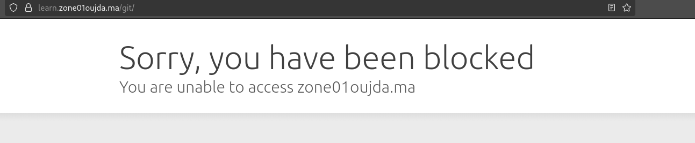
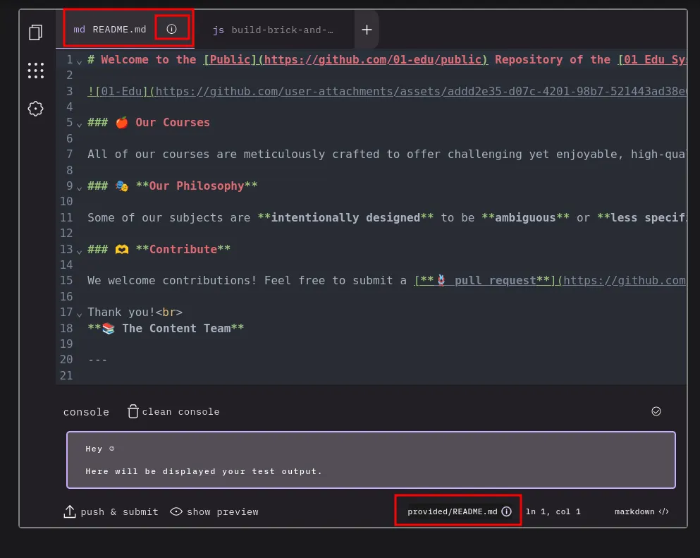
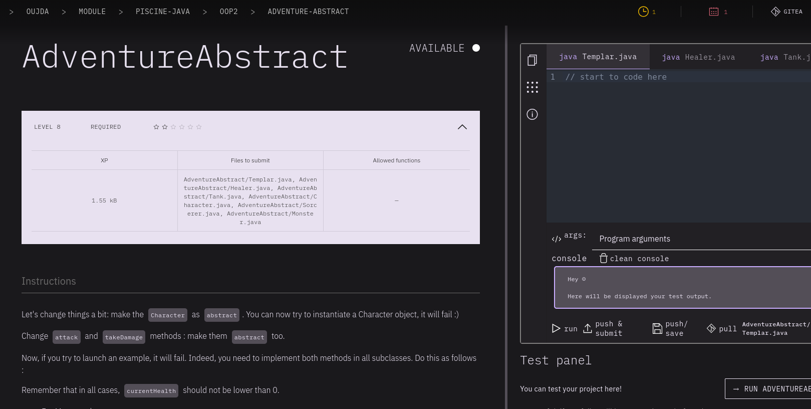

# Introduction

Zone01Oujda's git service ([Gitea](https://learn.zone01oujda.ma/git/)) is restricted outside campus through cloudflare's firewall.

But the [intra](https://learn.zone01oujda.ma/intra/) itself isn't restricted, and it uses git for reading and displaying subjects, testing students code and commiting files to students' repositories through the built-in code editor.

#### Cloudflare firewall

#### Code editor

# Observation

**push & submit** button uses the endpoint `/api/auto-git/:path` that handles gitea workflow.

the problem is the API docs doesn't explain how to use the endpoint and what's the expected payload/parameters, so we need to dig deeper in the source code of the webapp.

I found two methods to enable the code editor:

[the easy way](./the_easy_way.md)

[the hard way](./the_hard_way.md)

After enabling the code editor now you can pull from or push to gitea

#

another way is to perform a POST request to the endpoint directly

  
request details

| Name        | Type     | Decription                         | Example                                          |
| ----------- | -------- | ---------------------------------- | ------------------------------------------------ |
| :path       | pathname | An object path                     | oujda/module/piscine-java/java-intro/hello-world |
| x-jwt-token | header   | JWT token                          | \_                                               |
| \_          | body     | payload containing files to submit | `{"HelloWorld/HelloWorld.java": "file content"}` |

