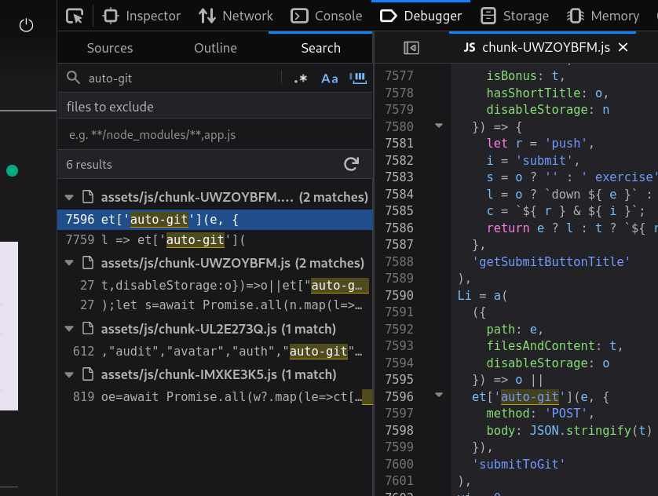
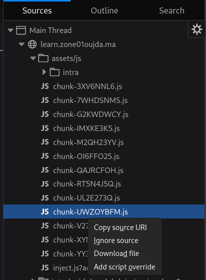

# Reverse engineering the UI

first thing to do is to search for where the targeted endpoint is being used in the code and add script override, then trace back where the function is being used.

### devtools search



### add script override



###

the function is exported in that file as:

```js
export { qa as a, du as b };
```

and is being used in another file as:

```js
import { b as W0 } from "./chunk-UWZOYBFM.js";
e(Su, {
  h100p: O,
  w100p: !0,
  children: e(ZO, {
    h60p: O && M,
    h100p: O && !M,
    children: [
      O &&
        e(
          W0,
          {
            initialFiles: w && Object.fromEntries(w.map((ue) => [ue, ""])),
            git: { repoName: f.rootName, user: t.login },
            resourceTabs: A?.providedFiles,
            setConsoleStd: M && m,
            onSubmit: Y,
            options: {
              cacheId: `${r.id}:${b}`,
              enablePreview: f.language === "dom",
              coolDownDuration: c[n.path],
              isBonus: M,
            },
            mb3: M,
          },
          b
        ),
    ],
  }),
});
```

there are too many ways to get what we need, the simplest way is to flip the condition `!O && e(W0, ...)` to render the editor into the UI.
